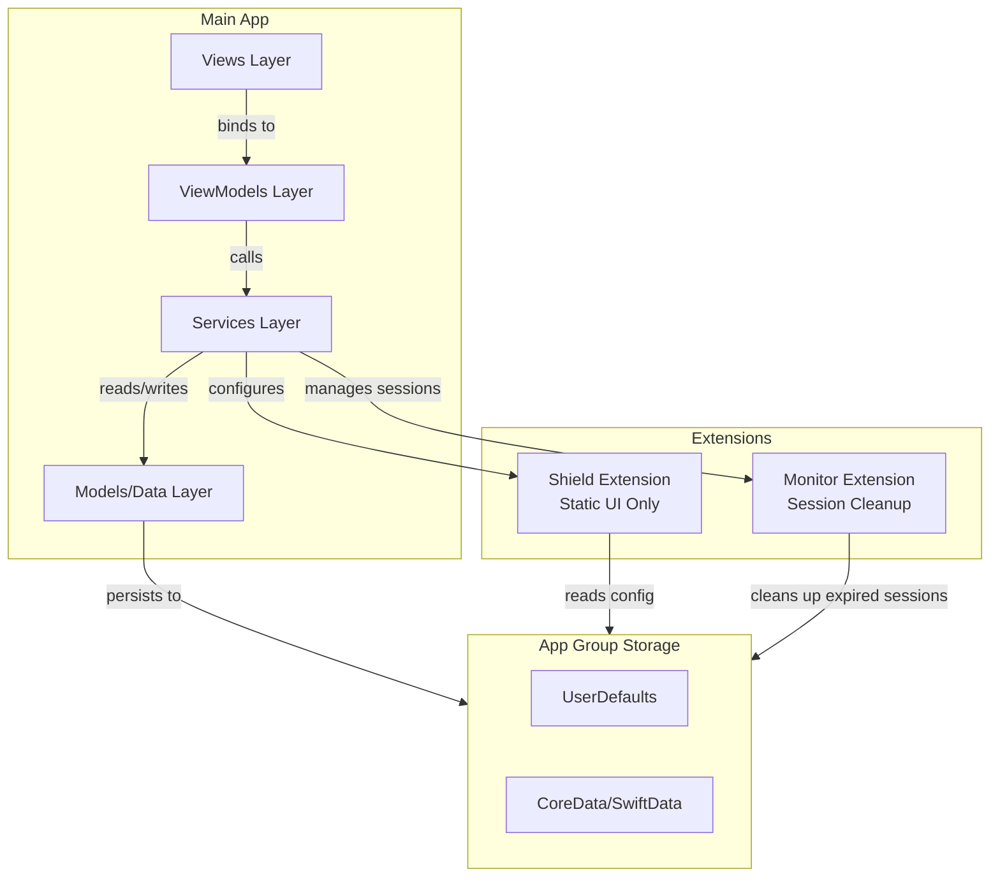
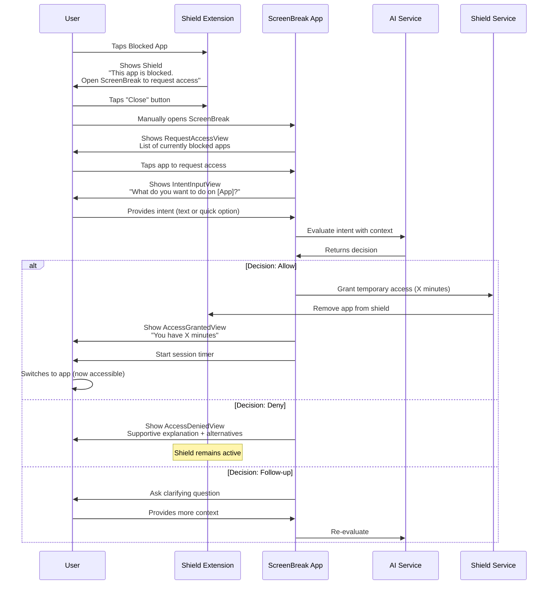

# Codebase Restructuring Plan for ScreenBreak/Trigg

## Current State Analysis

The codebase has foundational Screen Time API integration but lacks the core AI Gatekeeper feature. Current structure:

- Basic views scattered in [`ScreenBreak/ScreenBreak/Views/`](ScreenBreak/ScreenBreak/Views/)
- Minimal data models ([`MyModel.swift`](ScreenBreak/ScreenBreak/MyModel.swift), [`Persistence.swift`](ScreenBreak/ScreenBreak/Persistence.swift))
- AI chat service exists but not integrated ([`AIChatService.swift`](ScreenBreak/ScreenBreak/AIChatService.swift))
- Static shield extension ([`shield/ShieldConfigurationExtension.swift`](ScreenBreak/ScreenBreak/shield/ShieldConfigurationExtension.swift))
- Basic monitor extension ([`DeviceActivityMonitor/DeviceActivityMonitorExtension.swift`](ScreenBreak/ScreenBreak/DeviceActivityMonitor/DeviceActivityMonitorExtension.swift))
- Unused authentication views (Login, Register, SignIn)

## Critical Architectural Gaps

### 1. **Missing Core Feature: AI Gatekeeper Flow**

The entire app concept depends on intercepting shielded apps and asking "What are you about to do?" This doesn't exist yet. Per blueprints ([`02_flows.md`](blueprints/02_flows.md)), this requires:

- Interception screen when user opens shielded app
- User intent input (text or quick options)
- AI evaluation against pact rules
- Access granted/denied screens with time limits
- Post-session micro-reflection

### 2. **No Pact System**

Blueprints specify 14-day time-bound commitments with:

- Pact configuration (duration, daily limits, strictness)
- Progress tracking (day X of Y, streak counter)
- Motivation tracking
- Rules enforcement

### 3. **Data Architecture Issues**

- No App Group configured for shared data persistence
- CoreData not set up for app group sharing
- Missing data models: `Pact`, `Session`, `Attempt`, `PactRules`
- No proper separation between main app and extension data

### 4. **Simplified User Flow (Opal-Style)**

Following the Opal pattern for better UX and reliability:

- **Shield** → Shows static message: "This app is blocked. Open ScreenBreak to request access." + Close button
- **User** → Manually opens ScreenBreak app when they want access
- **Main App** → Shows blocked apps list, user selects app to request access
- **AI Gatekeeper** → Evaluates intent and grants/denies access
- **No complex extension communication needed** - User-initiated flow is simpler and more reliable

## Proposed Architecture



## Directory Structure

### Phase 1: Core Structure

```
ScreenBreak/ScreenBreak/
├── App/
│   └── ScreenBreakApp.swift
├── Models/
│   ├── Pact.swift
│   ├── PactRules.swift
│   ├── Session.swift
│   ├── Attempt.swift
│   └── AppSelection.swift
├── ViewModels/
│   ├── OnboardingViewModel.swift
│   ├── HomeViewModel.swift
│   ├── GatekeeperViewModel.swift
│   ├── SettingsViewModel.swift
│   └── SessionViewModel.swift
├── Views/
│   ├── Onboarding/
│   │   ├── WelcomeView.swift
│   │   ├── MotivationInputView.swift
│   │   ├── PactConfigurationView.swift
│   │   ├── ShieldedAppsSelectionView.swift
│   │   └── PactConfirmationView.swift
│   ├── Home/
│   │   ├── HomeView.swift (restructure existing)
│   │   ├── PactProgressCard.swift
│   │   ├── TodayStatsCard.swift
│   │   └── QuickActionsCard.swift
│   ├── Gatekeeper/
│   │   ├── RequestAccessView.swift (NEW - Shows blocked apps list)
│   │   ├── IntentInputView.swift (NEW - AI conversation)
│   │   ├── AccessGrantedView.swift (NEW - Approval screen)
│   │   ├── AccessDeniedView.swift (NEW - Denial screen)
│   │   ├── SessionTimerView.swift (NEW - Active session timer)
│   │   └── MicroReflectionView.swift (NEW - Post-session)
│   ├── Settings/
│   │   ├── SettingsView.swift
│   │   ├── ManageAppsView.swift
│   │   └── PactRulesView.swift
│   └── Components/
│       ├── TabBar.swift (keep existing)
│       └── LoadingAnimation.swift (keep existing)
├── Services/
│   ├── Authorization/
│   │   └── AuthorizationService.swift
│   ├── AI/
│   │   ├── AIChatService.swift (refactor existing)
│   │   ├── GatekeeperAIService.swift (NEW)
│   │   └── IntentEvaluator.swift (NEW)
│   ├── Shield/
│   │   └── ShieldManagementService.swift
│   ├── Activity/
│   │   ├── DeviceActivityService.swift
│   │   └── SessionMonitorService.swift (NEW)
│   └── Persistence/
│       ├── PersistenceController.swift
│       └── AppGroupStorage.swift (NEW)
└── Extensions/
    ├── Date+Extensions.swift
    └── View+Extensions.swift
```

### Phase 2: Extensions Update

```
ScreenBreak/shield/
└── ShieldConfigurationExtension.swift (update messaging)

ScreenBreak/DeviceActivityMonitor/
└── DeviceActivityMonitorExtension.swift (implement event detection)
```

## Implementation Strategy

### Stage 1: Foundation (App Group + Data Models)

**Priority: CRITICAL - Everything depends on this**

1. **Configure App Group** (`group.com.screenbreak.shared`)

   - Update entitlements for main app and all extensions
   - Create [`AppGroupStorage.swift`](ScreenBreak/ScreenBreak/Services/Persistence/AppGroupStorage.swift) service for shared data access

2. **Create Core Data Models**

   - [`Pact.swift`](ScreenBreak/ScreenBreak/Models/Pact.swift): startDate, duration, motivation, rules, currentDay, streak
   - [`PactRules.swift`](ScreenBreak/ScreenBreak/Models/PactRules.swift): dailyLimit, sessionLimit, strictness, quietHours
   - [`Session.swift`](ScreenBreak/ScreenBreak/Models/Session.swift): appToken, startTime, endTime, timeAllowed, timeUsed, intent
   - [`Attempt.swift`](ScreenBreak/ScreenBreak/Models/Attempt.swift): timestamp, appToken, intent, decision (allow/deny), reason

3. **Update CoreData Stack**

   - Modify [`Persistence.swift`](ScreenBreak/ScreenBreak/Persistence.swift) to use App Group container URL
   - Add SwiftData models if using iOS 17+

**Key Files to Modify:**

- [`ScreenBreak.entitlements`](ScreenBreak/ScreenBreak/ScreenBreak.entitlements)
- [`shield/shield.entitlements`](ScreenBreak/shield/shield.entitlements)
- [`DeviceActivityMonitor/DeviceActivityMonitor.entitlements`](ScreenBreak/DeviceActivityMonitor/DeviceActivityMonitor.entitlements)

### Stage 2: Services Layer (Business Logic)

**Priority: HIGH - Enables all features**

1. **AuthorizationService** - Wrap Screen Time API auth
   ```swift
   func requestPermissions() async throws
   func checkAuthorizationStatus() -> AuthorizationStatus
   ```

2. **GatekeeperAIService** - Core AI decision maker
   ```swift
   func evaluateIntent(
       intent: String,
       app: String,
       context: SessionContext
   ) async throws -> GatekeeperDecision
   ```


   - Use system prompt from [`AGENTS.md`](AGENTS.md) standards
   - Consider: time of day, recent usage, pact rules, strictness
   - Return: .allow(minutes: Int), .deny(reason: String), .followUp(question: String)

3. **ShieldManagementService** - Configure shields
   ```swift
   func activateShield(for apps: FamilyActivitySelection)
   func deactivateShield()
   func grantTemporaryAccess(to app: ApplicationToken, minutes: Int)
   ```

4. **SessionMonitorService** - Track active sessions
   ```swift
   func startSession(for app: ApplicationToken, duration: Int)
   func endSession()
   func checkForExpiredSessions()
   ```


### Stage 3: AI Gatekeeper Flow (THE CORE FEATURE)

**Priority: CRITICAL - This is what makes the app unique**

Simplified Opal-style flow where user manually opens ScreenBreak:



**Implementation Details:**

1. **Update Shield Extension**

   - Static message: "This app is blocked. Open ScreenBreak to request access."
   - Close button that dismisses shield (returns to home screen)
   - No event detection or communication needed
   - Reads shield configuration from App Group

2. **Create RequestAccessView** (Main entry point)

   - Shows list of currently shielded apps
   - User taps an app they want to access
   - Displays app icon + name using `Label(applicationToken)`
   - "Request Access" button for each app
   - Shows active sessions with countdown timers

3. **Create IntentInputView**

   - Full-screen modal for AI conversation
   - Text input field for intent
   - Quick option buttons (e.g., "Check messages", "Post content", "Just browsing")
   - "Give up" button to cancel request
   - Cannot be dismissed without completing flow

3. **AI Decision Logic** in GatekeeperAIService

   - System prompt:
     ```
     You are a supportive AI gatekeeper helping [User] with their goal: [Motivation].
     They're on day [X] of a [Y]-day pact. 
     Rules: [daily limit], [session limit], [strictness level].
     Current usage today: [minutes].
     Time: [HH:MM].
     
     User wants to open [App] because: [Intent].
     
     Decide: ALLOW (1-15 mins), DENY (supportive reason), or ASK (clarifying question).
     ```


4. **Create Access Views**

   - **AccessGrantedView**: Show timer, motivational message
   - **AccessDeniedView**: Supportive explanation, alternative actions
   - **SessionTimerView**: Countdown, "extend" option (requires new AI check)

### Stage 4: Onboarding Rebuild

**Priority: HIGH - User's first impression**

Replace generic onboarding with pact-focused flow per [`02_flows.md`](blueprints/02_flows.md):

1. **WelcomeView** - Problem statement + value prop
2. **MotivationInputView** - "Why are you doing this?"
3. **PactConfigurationView** - Duration (7/14/30 days)
4. **ShieldedAppsSelectionView** - Use FamilyActivityPicker
5. **PactRulesView** - Daily limit, session limit, strictness
6. **PactConfirmationView** - "Pact Started – Day 1 of 14"

**Use OnboardingViewModel to manage state:**

```swift
@Observable
class OnboardingViewModel {
    var motivation: String = ""
    var pactDuration: Int = 14
    var selectedApps: FamilyActivitySelection
    var rules: PactRules
    
    func createPact() async throws
}
```

### Stage 5: Home Dashboard Redesign

**Priority: MEDIUM - Daily user touchpoint**

Transform [`HomeView.swift`](ScreenBreak/ScreenBreak/Views/HomeView.swift) to show:

- **Pact Progress**: "Day 7 of 14" with visual progress
- **Streak Counter**: Days without breaking pact
- **Today's Stats**:
  - Attempts: 9 times
  - Time used: 26 min / 30 min limit
  - Time saved vs. usual usage
- **Quick Actions**: Settings, view insights

Remove the DeviceActivityReport (it's too generic) or move to separate tab.

### Stage 6: Settings & Management

**Priority: LOW - Can be basic initially**

Create [`SettingsView.swift`](ScreenBreak/ScreenBreak/Views/Settings/SettingsView.swift):

- Manage shielded apps (add/remove)
- Adjust pact rules (within constraints)
- Permissions status
- End pact early (with warning)

## Files to Delete

**Remove unused features** to reduce complexity:

- [`Views/LoginView.swift`](ScreenBreak/ScreenBreak/Views/LoginView.swift)
- [`Views/RegisterView.swift`](ScreenBreak/ScreenBreak/Views/RegisterView.swift)
- [`Views/SignInView.swift`](ScreenBreak/ScreenBreak/Views/SignInView.swift)
- [`Views/LeaderboardView.swift`](ScreenBreak/ScreenBreak/Views/LeaderboardView.swift)
- [`Views/CreateProfileView.swift`](ScreenBreak/ScreenBreak/Views/CreateProfileView.swift)
- All Firebase-related code (commented out AppDelegate)
- Widget extensions (focus on core app first)

## Critical Implementation Notes

### Screen Time API Constraints (from [`AGENTS.md`](AGENTS.md))

1. **Extensions cannot show custom UI** - Must use main app
2. **No network in extensions** - AI calls only from main app
3. **Opaque tokens** - Cannot decode app names for AI, use Label()
4. **Monitor delays** - `eventDidReachThreshold` may fire 1-2 mins late
5. **Memory limits** - Extensions have ~6MB limit

### User-Initiated Flow (Simplified)

Following the Opal pattern for better reliability and UX:

1. **Shield stays active** by default for all shielded apps
2. **User opens app** → sees shield: "This app is blocked. Open ScreenBreak to request access." + Close button
3. **User manually opens ScreenBreak** app when they want access
4. **User sees RequestAccessView** with list of blocked apps
5. **User taps app** they want to access → IntentInputView appears
6. **AI conversation** happens in ScreenBreak app
7. **After AI decision**, either:

   - **Allow**: Temporarily remove from shield for X minutes, show timer
   - **Deny**: Keep shield active, show supportive message

**Benefits of this approach:**

- No complex extension communication needed
- More reliable (no delays from `eventDidReachThreshold`)
- Better UX - user is in control and knows what to do
- Simpler architecture and easier to debug
- User expectation is set clearly in onboarding

## Testing Strategy

1. **Test with minimal 15-min schedules** (Screen Time API requirement)
2. **Mock AI responses** initially for faster iteration
3. **Test App Group data flow** between app and extensions
4. **Test shield removal/reactivation** timing
5. **Test authorization denial** gracefully

## Migration Path

Since there's existing data in `MyModel` and `Persistence`:

1. Create new data models alongside old ones
2. Migrate `selectionToDiscourage` to new `AppSelection` model
3. Keep old `ConfigRestrictionsView` temporarily for fallback
4. Feature flag to switch between old and new flows
5. Remove old code after validation

## Success Criteria

- [ ] User can complete onboarding and create a pact
- [ ] Opening shielded app shows clear shield message with instruction
- [ ] User can open ScreenBreak and see list of blocked apps
- [ ] User can request access to blocked app via AI conversation
- [ ] AI can allow/deny based on intent and rules
- [ ] Granted sessions respect time limits and re-shield automatically
- [ ] Home dashboard shows pact progress accurately
- [ ] Data persists across app launches via App Group
- [ ] No authorization errors on fresh install
- [ ] Shield configuration reads from shared storage correctly