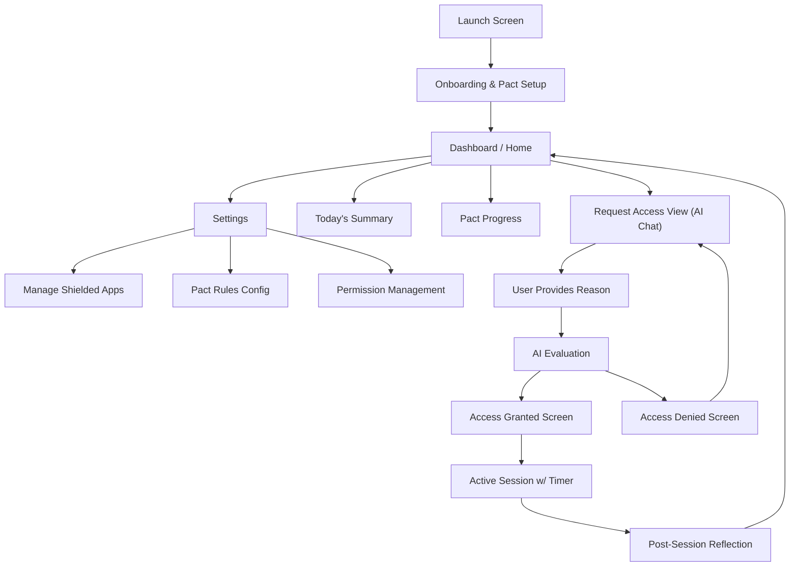
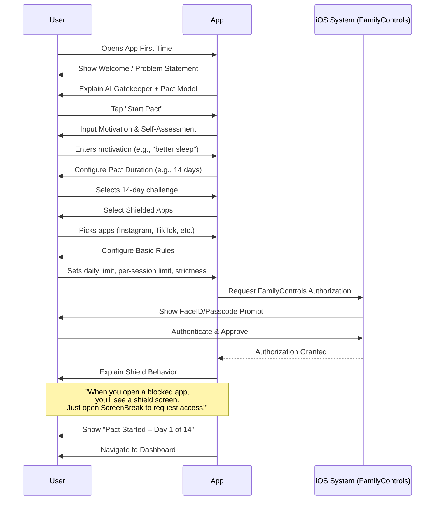
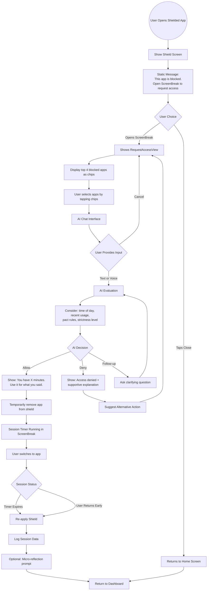
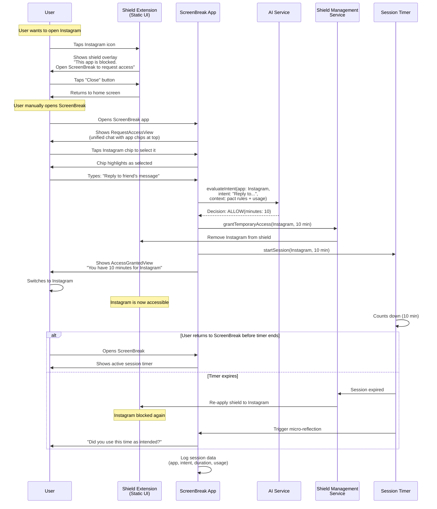
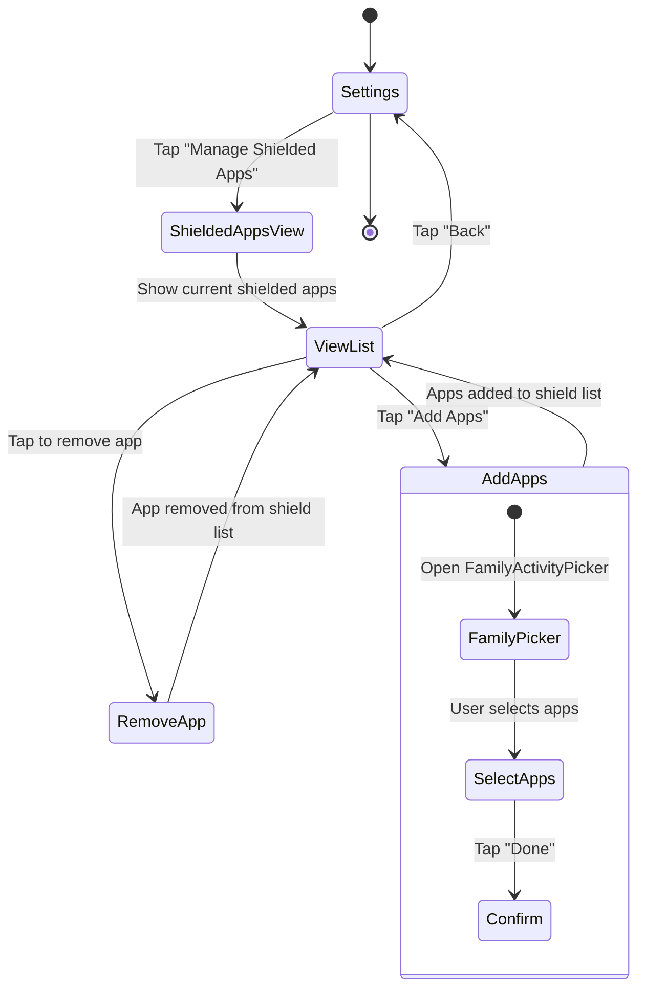

Based on the core functionality of **Trigg** (an AI-powered app blocker using Screen Time APIs, DeviceActivity, and FamilyControls), this document outlines the minimal viable flows.

Trigg uses an **AI Gatekeeper** approach where users must state their intent before accessing shielded apps. The app operates on a **time-bound pact system** (e.g., 14-day commitments).

## Architectural Approach: User-Initiated Flow (Opal Pattern)

**Important:** Due to iOS Screen Time API limitations, we use a **user-initiated flow** similar to Opal:

1. **Shield shows static message**: "This app is blocked. Open ScreenBreak to request access" + Close button
2. **User manually opens ScreenBreak** when they want access to a blocked app
3. **User sees blocked apps list** and taps the one they want
4. **AI conversation happens** in ScreenBreak app (has network access)
5. **Access is granted or denied** based on AI evaluation

**Why this approach:**
- ✅ More reliable (no delays from extension callbacks)
- ✅ Simpler architecture (no complex App Group event communication)
- ✅ Better UX (user is in control and knows what to do)
- ✅ Easier to debug and maintain
- ✅ Works within iOS extension sandboxing constraints

**What we avoid:**
- ❌ No automatic triggering of main app from extension
- ❌ No notifications to wake the app
- ❌ No polling for pending attempts
- ❌ No unreliable `eventDidReachThreshold` timing issues

### 1. High-Level Site Map (Minimal Version)

This diagram represents the core screens needed for v1 functionality.

---

### 2. Core User Flows (Minimal v1)

These diagrams represent the essential user journeys for the initial version.

#### **Flow A: Onboarding & Pact Setup**

The onboarding flow establishes the user's commitment and configures the AI gatekeeper.

#### **Flow B: The AI Gatekeeper Flow (The Core Feature)**

This is the core flow where a user tries to open a shielded app and must explain their intent to the AI. Following the Opal pattern, the user manually opens ScreenBreak to request access.

**Detailed Sequence Diagram:**

This shows the complete interaction between components in the simplified user-initiated flow.

#### **Flow C: Managing Shielded Apps (Post-Onboarding)**

How a user modifies their shielded apps list after initial setup.

